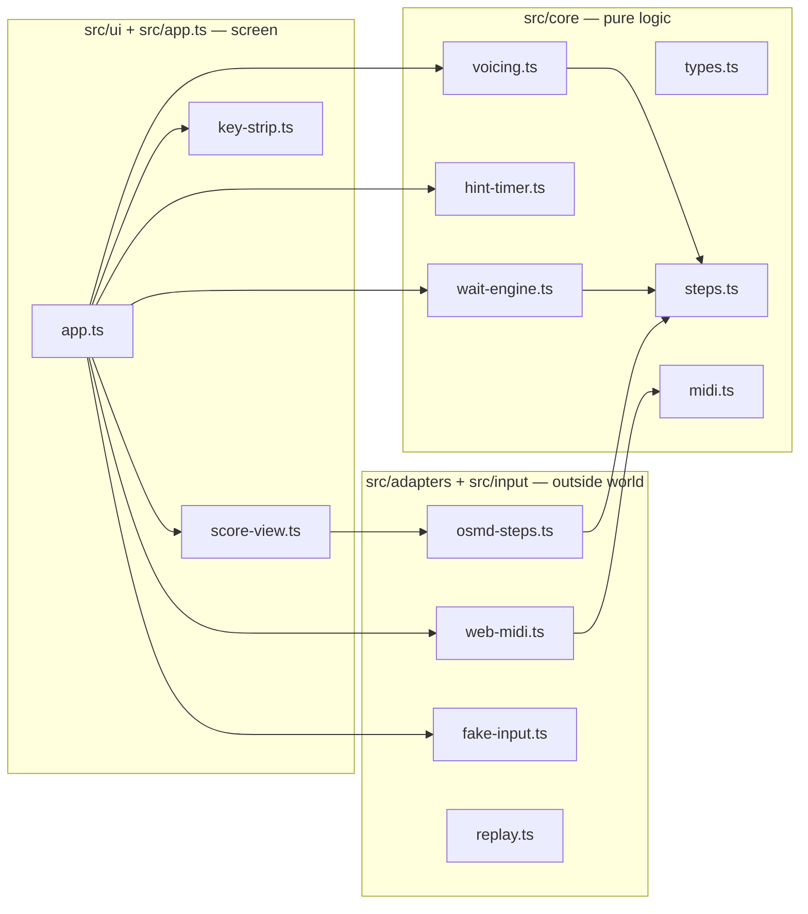
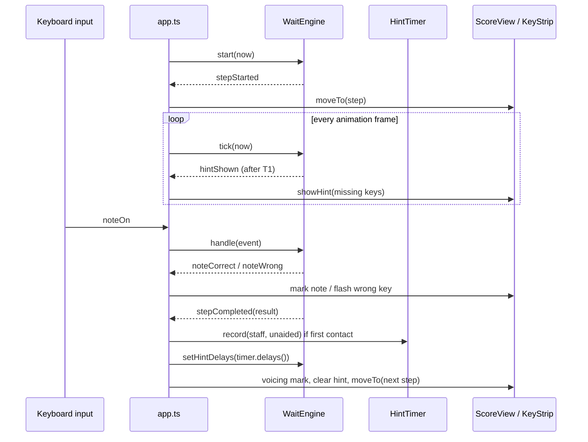

# Virtuoso — Architecture

Version 0.2 · 29 September 2026 · Owner: Claude (architect). Changes go through a decision
record in `docs/decisions/`.

## 1. Stack

| Piece | Choice | Version (pinned) | Why |
|---|---|---|---|
| Language | TypeScript, strict | 7.0.2 | Type errors are feedback agents get on their own |
| Runtime | Chrome or Edge on Windows | current | Web MIDI works there; Safari has none |
| Score display and parsing | OpenSheetMusicDisplay (OSMD) | 2.1.3 | Renders MusicXML, draws a bar range, steps a cursor, recolors notes |
| Keyboard input | Web MIDI API | browser | Built in; no drivers or native code |
| Build and dev server | Vite | 8.3.1 | `npm run dev` serves the app and `tools/` |
| Tests | Vitest (+ jsdom for OSMD parsing) | 5.0.2 / 30.1.1 | Fast, TypeScript-native |
| Lint and format | Biome | 2.5.14 | One tool, one config |
| Storage (M2) | IndexedDB via `idb` | add in M2 | Local, survives restarts |
| PDF view (M3) | `pdfjs-dist` | add in M3 | Shows the original page beside the rendered bars |
| PDF conversion (M3) | Audiveris, outside the app | latest release | Open-source optical music recognition with MusicXML export |

Pinned versions are exact on purpose. Upgrades are their own task.

## 2. Layers

**Dependency rule.** Arrows point inward only. `src/core` imports nothing from `adapters`,
`input`, `ui` or `app`, and uses no DOM, browser API, clock or randomness. Time always comes in as
a parameter. `tests/architecture.test.ts` enforces this and keeps OSMD inside
`src/adapters/osmd-steps.ts` and `src/ui/score-view.ts`.

## 3. Modules

| File | Does | Task |
|---|---|---|
| `src/core/types.ts` | Shared data types: `Step`, `StepNote`, `InputEvent`, ranges | done |
| `src/core/steps.ts` | Folding into range; required keys per step and staff | done |
| `src/core/midi.ts` | Raw MIDI bytes → `InputEvent`; channel lock | T01 |
| `src/adapters/osmd-steps.ts` | MusicXML → `Step[]` through OSMD's parser | T02 |
| `src/core/wait-engine.ts` | Wait-mode state machine: correct, wrong, hints, step results | T03 |
| `src/core/hint-timer.ts` | T1 per staff, weighted staircase | T04 |
| `src/core/voicing.ts` | Melody note, voicing lead, summary | T05 |
| `src/input/*`, `src/adapters/web-midi.ts` | Keyboard sources: MIDI, computer keys, replay, recorder | T06 |
| `src/ui/score-view.ts`, `src/ui/key-strip.ts` | Score with cursor and colors; on-screen keys | T07 |
| `src/app.ts` | Wires the first playable slice | T08 |

## 4. Wait mode, one step

## 5. Time

All times are milliseconds on the `performance.now()` clock. Web MIDI's
`MIDIMessageEvent.timeStamp` and `KeyboardEvent.timeStamp` use the same clock, so event times
and `tick(performance.now())` compare directly. Only `app.ts` and the input adapters read the
clock.

## 6. OSMD facts (verified on 2.1.3)

Checked in this repo on 29 September 2026; the tests in `tests/adapters/` pin the parsing
behaviour.

- `osmd.load(xml)` parses without rendering, including under jsdom in Node. Rendering in jsdom
  is not reliable (no canvas); render only in a real browser.
- Walk the score with `osmd.Sheet.MusicPartManager.getIterator()`: `EndReached`,
  `moveToNext()`, `currentTimeStamp.RealValue` (whole notes), `CurrentMeasureIndex`,
  `CurrentVoiceEntries`.
- Per voice entry: `ParentSourceStaffEntry.ParentStaff` (its index in
  `ParentInstrument.Staves` gives the staff), `ParentVoice.VoiceId`, `IsGrace`, `Notes`.
- Per note: `isRest()`, `halfTone` (**MIDI = halfTone + 12**), `NoteTie` (a tie continuation
  has `NoteTie.StartNote !== note`).
- The iterator follows repeat signs by default. Set
  `osmd.EngravingRules.CursorIgnoreRepetitions = true` before iterating to get written order.
- In Chromium: `setOptions({ drawFromMeasureNumber, drawUpToMeasureNumber })` then `render()`
  draws a bar range (1-based, inclusive); `cursor.show()` starts at the first drawn bar;
  `cursor.next()` moves one position; `cursor.GNotesUnderCursor()` returns graphical notes;
  `gNote.setColor(color, { applyToNoteheads: true, applyToStem: true })` recolors without
  re-rendering. A re-render clears colors, so the view re-applies them.
- `setOptions()` resets `cursorsOptions` to the default green cursor whenever a call omits
  them, so pass the same `cursorsOptions` in every `setOptions` call (found 4 October 2026).
- On a chord, `gNote.getNoteheadSVGs()` returns every notehead of the chord, lowest first.
- `drawFromMeasureNumber`/`drawUpToMeasureNumber` are 1-based positions only when the score has
  no pickup bar. If `Sheet.SourceMeasures[0].ImplicitMeasure` is true, `render()` treats them as
  printed bar numbers (pickup = 0). To draw indices `first..last` in every score, set
  `EngravingRules.MinMeasureToDrawIndex`/`MaxMeasureToDrawIndex` directly and the matching
  `Min/MaxMeasureToDrawNumber` (found 4 October 2026 with the BWV 269 sample).

## 7. Testing

- **Unit tests** for everything in `src/core` and the pure parts of `src/input`. Deterministic:
  no clock, no randomness (tests use a seeded generator when they need one).
- **Parser tests** run OSMD under jsdom against `fixtures/musicxml/`.
- **Replay tests** (from M2): recorded sessions in `fixtures/sessions/` fed through the engine.
- **UI** is checked by screenshots in pull requests and by the player's play-test.
- Tests are contracts written by the architect. Implementers make them pass; they don't edit
  them. A test that looks wrong is raised as a question.

## 8. Browser and permissions

- Chrome and Edge ask the player's permission before any Web MIDI access
  ([since Chrome 124](https://developer.chrome.com/blog/web-midi-permission-prompt)).
  The app asks once, on a click, and explains a refusal.
- Web MIDI needs a [secure context](https://developer.mozilla.org/en-US/docs/Web/API/Navigator/requestMIDIAccess);
  `http://localhost` (the Vite dev server) qualifies.

## 9. Decisions

See `docs/decisions/`. Each record states the decision, why, and what would change it.
